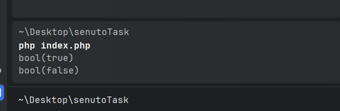

### Pomysły na rozwiązanie problemu

1. Dodanie losowego opóźnienia między wypełnianiem pól formularza (w JS, po stronie klienta),
możemy wtedy odblokowywać kolejne pola po upływie losowego czasu (np. 1-3 sekund). 
Boty wypełniają formularze praktycznie od razu, więc takie rozwiązanie może je zatrzymać.
(Niestety nie jest to skuteczne przy atakach bezpośrednio na endpoint na backendzie).

2. Wymaganie potwierdzenia wysłania formularza poprzez e-mail lub SMS.
Lepszy będzie SMS - niestety wiąże się z kosztami (centralek SMS).

3. Korzystanie z zewnętrznych usług np. Cloudflare. Dodatkowo zyskujemy wtedy ochronę przed atakami DDoS.
Niestety to rozwiązanie jest również płatne.

4. Zbudowanie własnego mini-CAPTCHA (np. pytanie matematyczne, czy rozpoznawanie obrazków).
Możemy zbudować własną bazę obrazków, pytań oraz poprawnych odpowiedzi. 
Rozwiązanie stosowane na starszych stronach typu "wpisz wynik działania 2+2".
Boty zazwyczaj nie posługują się OCR, aby odczytywać tekst z obrazków, dodatkowo sam tekst na tych obrazkach jest mocno zniekształcony.
Proste i skuteczne.

5. Dodanie ukrytego pola w formularzu (type="hidden") – człowiek nie będzie w stanie uzupełnić takiego pola,
a boty zazwyczaj wypełniają wszystkie pola formularza. (tzw. honeypot). Sposób podejścia do tego rozwiązania pokazałem w kodzie.

### Krótki opis kodu

Skorzystałem z composera, aby wymusić działanie aplikacji pod najnowszą wersją PHP. Pozwala też to na łatwy autoload klas korzystając z przestrzeni nazw.
W katalogu aplikacji umieściłem drobny moduł Security. Składa się on z klasy FormBotProtection,
która zawiera metody do zabezpieczenia formularza przed botami. W katalogu Services umieściłem usługi, z których mogą korzystać klasy we/wy do modułu.
W katalogu Interfaces umieściłem interfejsy, które są wykorzystywane w serwisach.
Serwisy wtedy nawiązując kontrakt zobowiązują się do dostarczenia w tym przypadku metody walidacyjnej.
Starałem się ukazać wzorce
1. SRP - każda klasa ma jedną odpowiedzialność.
2. OCP - zasada otwarte/zamknięte - klasy są otwarte na rozszerzenie, ale zamknięte na modyfikację.
3. DI - zasada odwrócenia zależności - zależności wstrzykiwane są z zewnątrz. Gdy będziemy chcieli zmienić walidator na inny zmienimy jedynie jego implementację.

### Wynik szybkiego testu w konsoli

